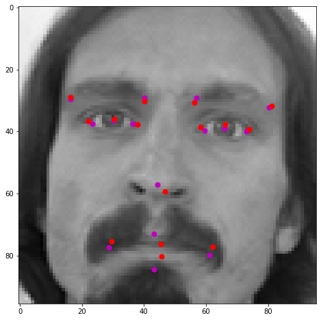
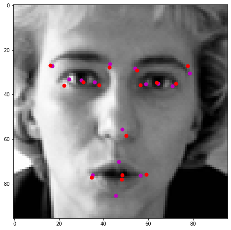
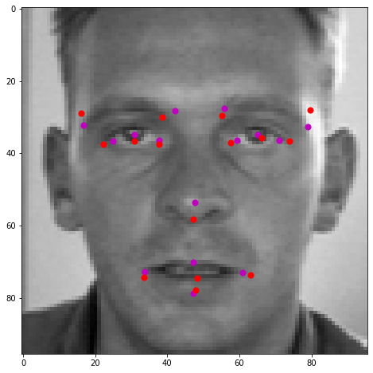

The goal of this project is to build a deep learning model that is able to correctly classify each pixel of the image. The **MSRC-v2 Dataset** was used for training and testing the model. It contains 591 Images and 23 different objects (classes). 
The Model consists of two parts: 

1. Encoder
2. Fully Connected Layers

For Encoder was used a Convolutional neural network. Its architecture consists of Convolutional, Max Pooling and Dropout layers. Exponential Linear Unit turned out to be the most suitable activation function for the encoder.
The fully connected layers of the model are combined with ReLU activation function and Dropout layers.

Results:

**PyTorch** was used for the development of the model.
