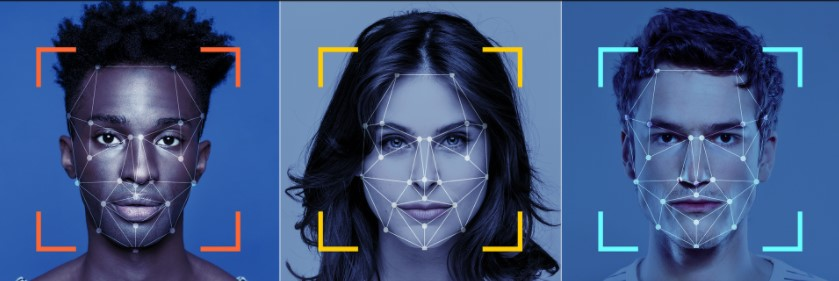

The goal of this project is to build a deep learning model that is able to detect important keypoints on the human face. These keypoints mark important areas of the face like the eyes, corners of the mouth, the nose, etc. and are relevant for a variety of computer vision tasks, such as face filters, emotion recognition, pose recognition, and more.

The Model consists of two parts: 

1. Encoder
2. Fully Connected Layers

For Encoder was used a Convolutional neural network. Its architecture consists of Convolutional, Max Pooling and Dropout layers. Exponential Linear Unit turned out to be the most suitable activation function for the encoder.
The fully connected layers of the model are combined with ReLU activation function and Dropout layers.

**Results:** 

__Red: Prediction \
Purple: Ground Truth__

**PyTorch** was used for the development of the model.
